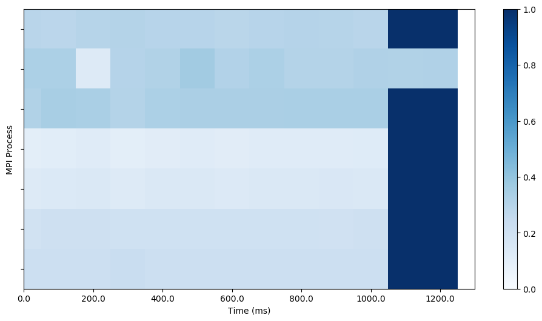
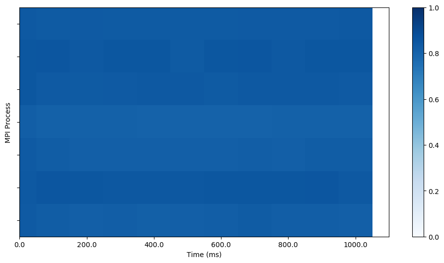
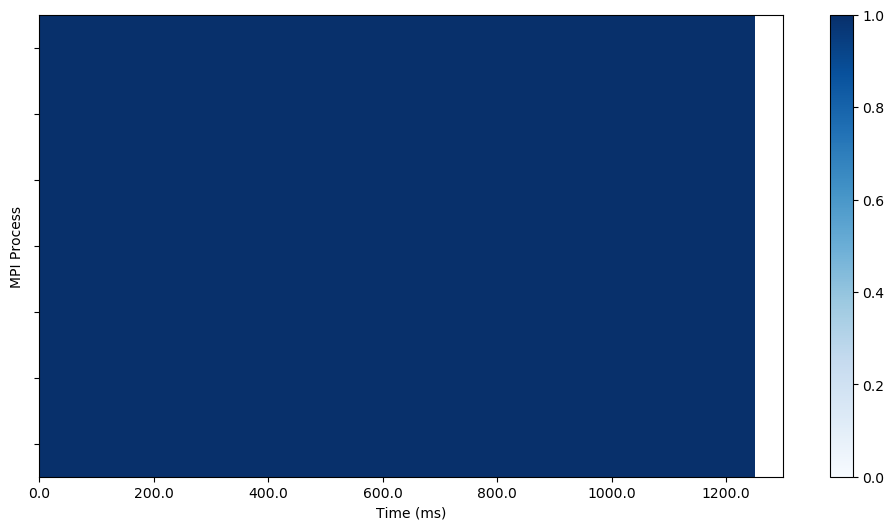

# Test report for variance analysis (20240509 by YX)

## Test scripts

This test includes MPI benchmark programs on CPUs and test the validity of `variance_analysis`, `variance_analysis_mpi`, and corresponding heatmap generation scirpts (`heatmap.py` and `heatmap_mpi.py`). The data is collected by `jsirun` with backtrace and pmu enabled (collecting PAPI_TOT_INS). All test commands are included in `run_test.sh` scripts.

## Expected outputs

The test script should output with the following outputs. Any `FAILED` outputs indicates the specified test is failed. The standard output and error logs are located in `run-<date>` directory.

```
$ ./run_test.sh
# Running tests for variance_analysis
=== Preparing test programs ===
rm -rf *.o test
mpicc test.c -o test -lm
MAKE  PASSED 
=== Collecting test data for variance_analysis
JSIRUN  PASSED 
=== Validating test data with jsiread ===
jsiread  PASSED 
=== Running test for variance_analysis ===
variance_analysis  PASSED 
heatmap  PASSED 
=== Running test for variance_analysis_mpi ===
variance_analysis_mpi  PASSED 
heatmap_mpi  PASSED
```

### Example Figure

The output figures of the test is listed as follows.

**CALC heatmap of variance_analysis**


**COMM heatmap of variance_analysis**



**CALC heatmap of variance_analysis_mpi**



**COMM heatmap of variance_analysis_mpi**

